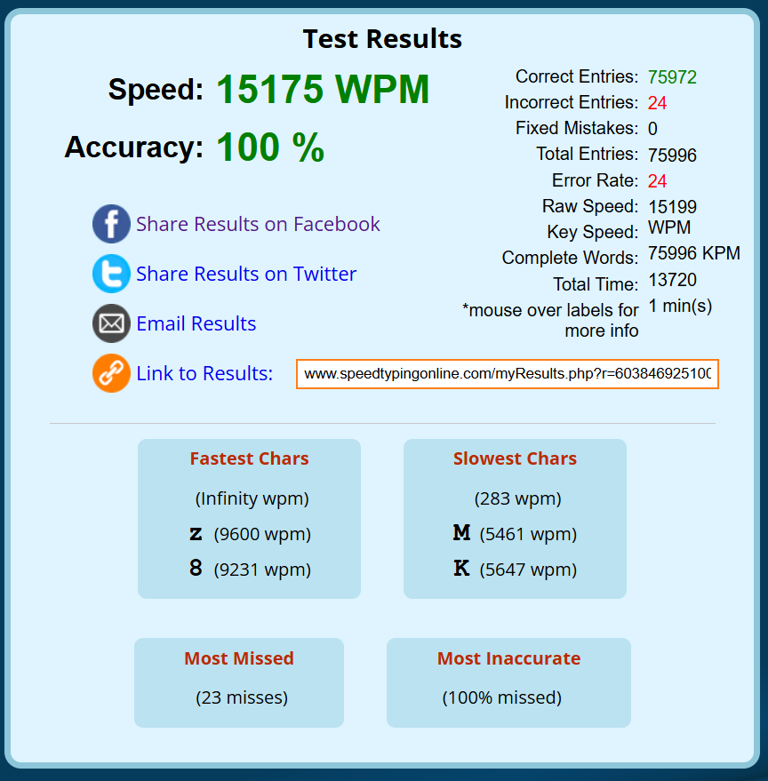

# SimulateInput
A program to simulate keyboard and mouse inputs



You can also see this [here](https://www.speedtypingonline.com/myResults.php?r=60384692510057160&d=920907780188256)

# Overview
This program uses its own language to parse inputs submitted in a file and play those inputs when you start it. This process allows it to do inputs *really* fast. In fact this can simulate mouse clicks faster than [The Fastest Mouse Clicker for Windows](https://github.com/windows-2048/The-Fastest-Mouse-Clicker-for-Windows). This is much easier to explain with an example:

If you create a file called `keys.txt` and inside it write:
```
kHello World!
```
In the backend the program finds all the keys that will result in each of the characters in `Hello World!` and store it. If you run this program, it will output this message:
```
No file entered, defaulting to "keys.txt"
Read length: 13
Compiling...
Done compiling, press Enter to run
```
If you press Enter it will simulate you typing out `Hello World!`.

If you want custom files, run the program like `simulate <filename>`. There is also a flag `-W` which makes it so if there's any warnings you will not be allowed to execute the program. So e.g. to run the program for the file `coolfile.txt` and with the flag do:
```
simulate coolfile.txt -W
```
# Language specification
The language consists of these 22 characters `SswPpLlMmRrnkKCc()[]{}`:
- `Ss` is sleep, and is followed by a number. `S` means you want a sleep after every input, so `S1000` means after every input the program will pause for 1000 ms. `s` is to sleep right now, so `s1000` will cause the program to sleep when it reaches that point and never again unless you insert a new one. These two will stack
- `w` is wheel scroll, and is followed by a number. E.g. `w200` to scroll up 200 units or `w-200` down 200 units. One scroll click is usually 120 units.
- `Pp` is position, and is followed by two numbers separated by a comma. `P` is absolute position where the coordinate is `0,0` at the top left and `65535,65535` at the bottom right. `p` is the relative unit, and is specified in pixels moved. Usage example: `P256,342`
- `LlMmRr` is click, `L` is left click down and `l` is left click up. Similarly for `Mm` which is middle click and `Rr` is right click
- `n` is numpad. E.g. if you want to simulate pressing "1" but not on the keyboard but the numpad, use `n1`
- `k` is keyboard. It automatically detects whether shift, ctrl, or alt is needed and which key need to press to produce the character specified
- `K` is keyboard layout, and is followed by a hex number. Use this to set the keyboard layout which may affect `k`'s output. This is defaulted to `00000409` which is "US Keyboard". Usage example: `K00140C00` to change it to "ADLaM." A list can be found [here](https://learn.microsoft.com/en-us/windows-hardware/manufacture/desktop/windows-language-pack-default-values)
- `Cc` is virtual key code, and is followed by hex. `C` is down and `c` is up. E.g. if you want to press the Ctrl key down you do: `C11`. A list can be found [here](https://learn.microsoft.com/en-us/windows/win32/inputdev/virtual-key-codes)
- `()` is a mouse input group. Every mouse command within the brackets will be combined into a single mouse input, so you can do `(P0,0Ll)` to move to (0,0) and left click with one input.
- `[]` is an input array, and is followed by a number. Every command within the brackets is put inside a large array and sent to `SendInput` at once. This allows you to send inputs much faster than normal. The number that follows is the number of times the commands inside the bracket are repeated, and can be nested. This is processed at compile-time and in the backend it duplicates the commands. E.g. `[L]10` is equivalent to `[LLLLLLLLLL]`, and `[L[R]2]3` is equivalent to `[LRRLRRLRR]`
- `{}` is a loop, and the open bracket is followed by a number. This differs from above in that it does not inflate the array, and is processed at runtime. So `{2[L]2}` will run as `[LL][LL]`, which is slower than `[L]4` which is `[LLLL]`

# Notes
- The program reads everything as arguments to the command as long as the character can be an argument. So e.g. `P100,200Ll` will read `P` and look for 2 numbers. It will scan `100` and then see a comma, which is not a number, so it assumes you are now entering the second number. After scanning `200`, it will see `L` which is not a number so it assumes the argument is over.
- To add to above, `k` is special in that it reads characters to decode into key presses, so it will assume everything is its argument except newline ("\n" or "\r")
- For `Cc` it assumes hex come in groups of 2, except when it reads an odd number of hex codes which then it assumes the first one is a single letter. So `CA1B0203` will press the keys `0A`, `1B`, `02`, `03`
- The `S` will insert a sleep between the key down and key up of commands like `ka`, to only insert on key up put the `ka` in square brackets
- Having too many things within `[]`, or having high repeat count, can overflow the input buffer and result in slower speed
- `K` is processed at compile time, so putting it in loops will not result in setting the layout in some looped manner
# Examples
Fast Hello World. Note that the close bracket is on a new line because otherwise it assume you want to type `]`
```
[kHello World!
]1
```
Fast Hello World 10 times:
```
[kHello World!
]10
```
Fast Hello World in key code:
```
[C1048
c1048
C454C
c454C
C4C4F201057
c4C4F201057
C4F524C441031
c4F524C441031]1
```
Hello world but wait 1 second before typing and wait 1 second between every character. This is a bit clunky lol
```
S1000s1000[kH
]1[ke
]1[kl
]1[kl
]1[ko
]1[k 
]1[kW
]1[ko
]1[kr
]1[kl
]1[kd
]1
```
Fast Hello World 10 times but sleep for 1 second between each time
```
{10[kHello World!
s1000]1}
```
The code I used to test the program:
```
K00000409s500S20Rr(P0,0Ll)n5[kb
[ka
(Mm)]2]2(P30000,30000{50(p-5,-5w-200
```
The above will do these in order:
- Set the keyboard layout to `00000409`
- Sleep for 500ms
- Set the sleep between action to 20ms
- Right click
- Move mouse to (0,0) and left click at the same time
- Press the `5` on a numpad
- Do this really fast, and do it twice:
  - Press `b`
  - Repeat 2 times: press `a` and then middle click
- Move mouse to (30000,30000)
- Repeat the following 50 times
  - Move the mouse left and up by 5 pixels each, and scroll up 200 units, both at the same time

You may notice that a few brackets are missing. This is intended lol


